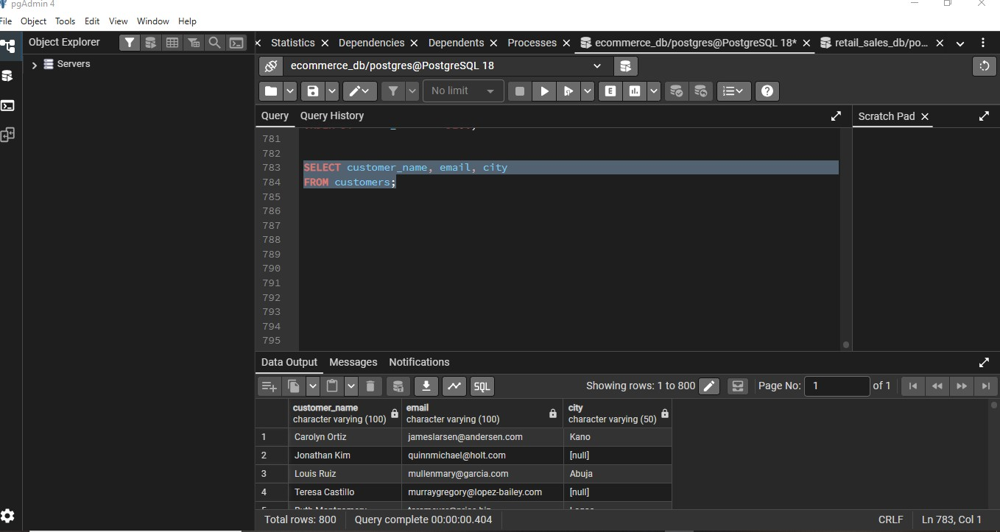
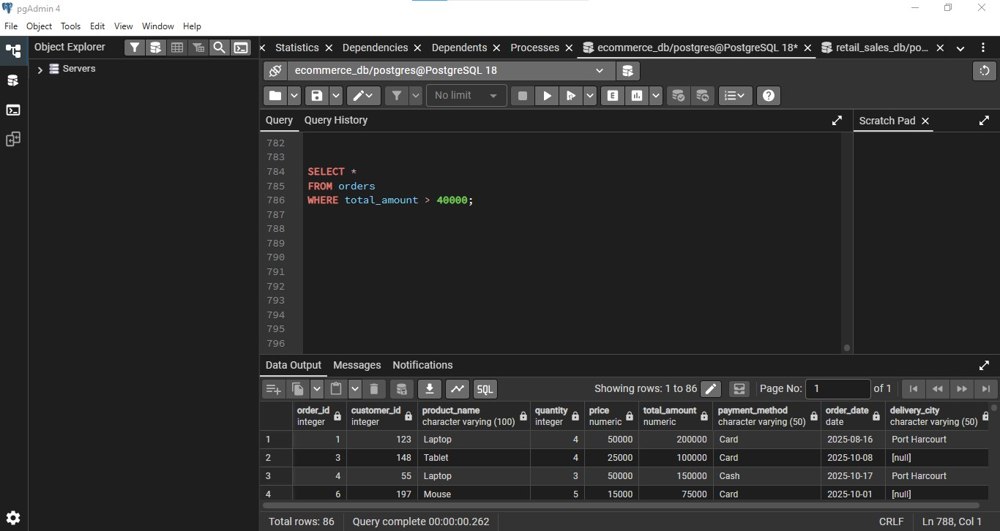
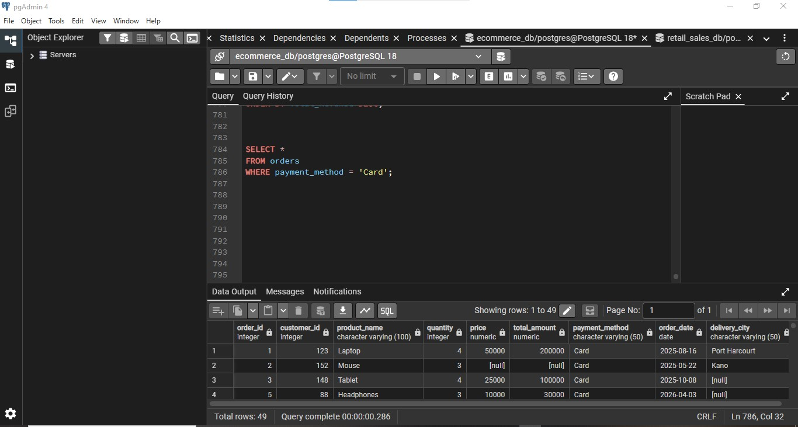
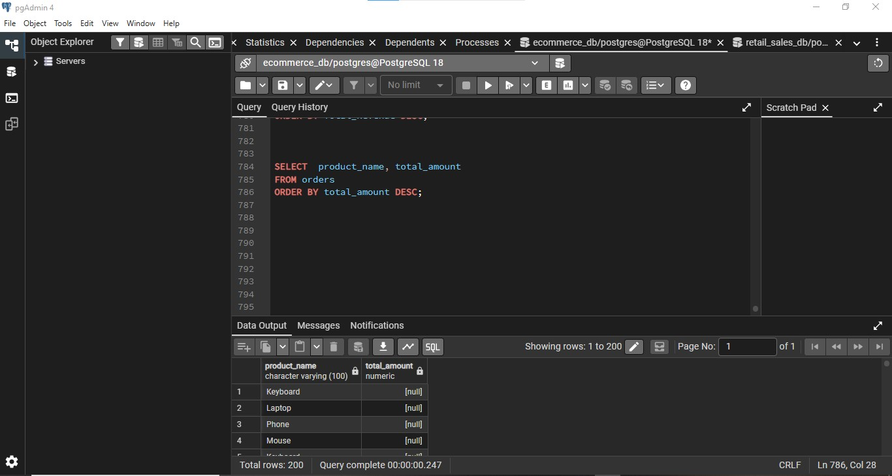
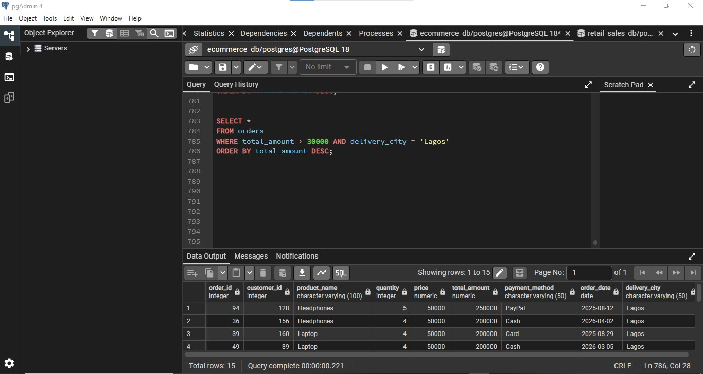

# E-Commerce Customer & Order Analysis (SQL)

Querying and analyzing e-commerce customer and order data using SQL in PostgreSQL (pgAdmin 4) to answer real business questions around customer segmentation, payment behavior, and high-value orders.

## Project Overview

This project uses a two-table e-commerce dataset (customers and orders) to practice and demonstrate core SQL querying skills: filtering, sorting, and combining conditions to answer business-relevant questions, such as identifying high-value transactions and segmenting customers by location.

**Tools used:** PostgreSQL, pgAdmin 4

## The Data

- **Customers dataset:** `data/ecommerce_customers.csv` — 199 customer records (customer_id, customer_name, email, phone_number, city, gender, signup_date)
- **Orders dataset:** `data/ecommerce_orders.csv` — 199 order records (order_id, customer_id, product_name, quantity, price, total_amount, payment_method, order_date, delivery_city)

## Queries & Business Questions

All queries are in [`ecommerce_queries.sql`](ecommerce_queries.sql). Each one answers a specific business question:

### 1. Basic customer lookup
Retrieve customer name, email, and city for all customers.
```sql
SELECT customer_name, email, city
FROM customers;
```



### 2. High-value orders
Show all orders where the total amount exceeds 40,000.
```sql
SELECT *
FROM orders
WHERE total_amount > 40000;
```



### 3. Payment method filtering
Retrieve all orders paid for with a Card.
```sql
SELECT *
FROM orders
WHERE payment_method = 'Card';
```



### 4. Ranking orders by value
Show product name and total amount, sorted from highest to lowest.
```sql
SELECT product_name, total_amount
FROM orders
ORDER BY total_amount DESC;
```



### 5. Customer segmentation by city
Retrieve all customers based in Abuja and Lagos.
```sql
SELECT *
FROM customers
WHERE city IN ('Abuja', 'Lagos');
```

### 6. Business question — recent high-value orders from Lagos
The sales manager wanted to see recent high-value orders specifically from Lagos, to understand performance in that market.
```sql
SELECT *
FROM orders
WHERE total_amount > 30000 AND delivery_city = 'Lagos'
ORDER BY total_amount DESC;
```



## Key Insights

1. Combining filter conditions (amount + city) surfaced a focused list of high-value Lagos orders, giving the sales team a targeted view instead of scanning the full orders table.
2. Sorting by `total_amount DESC` immediately highlights the highest-value transactions across all products, useful for identifying top revenue drivers.
3. Segmenting customers by city (`Abuja`, `Lagos`) is a simple but effective first step toward regional customer analysis.

## Skills Demonstrated

- Writing SQL `SELECT` queries with column selection
- Filtering data with `WHERE`, comparison operators, and `IN`
- Combining multiple conditions with `AND`
- Sorting results with `ORDER BY`
- Translating a business question into a precise SQL query
- Working in PostgreSQL via pgAdmin 4
